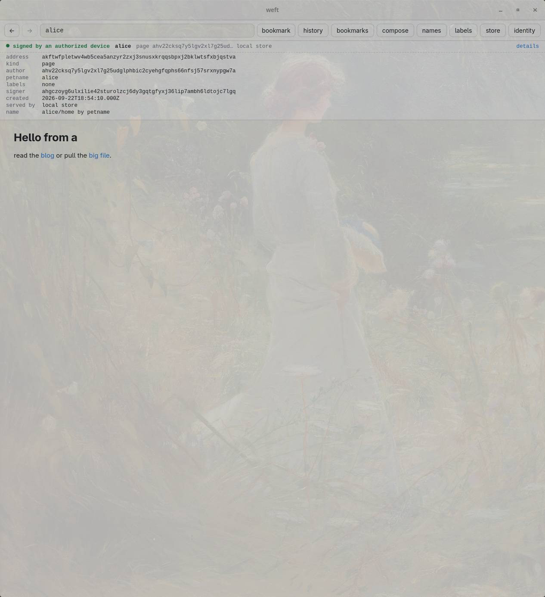

```
██╗    ██╗███████╗███████╗████████╗
██║    ██║██╔════╝██╔════╝╚══██╔══╝
██║ █╗ ██║█████╗  █████╗     ██║   
██║███╗██║██╔══╝  ██╔══╝     ██║   
╚███╔███╔╝███████╗██║        ██║   
 ╚══╝╚══╝ ╚══════╝╚═╝        ╚═╝   
                        a k r v s
```

> Sign. Address. Verify. Repeat. A web where the reader holds the keys and
> the content outlives the host. Every record is signed and named by its
> hash, identity is a keypair you own, and nothing in the protocol has a
> slot for watching you. This repo is the thread the rest gets woven onto.


```
┌─[ TARGET ]──────────────────────────────────────────────────────┐
│ codename   : weft                                               │
│ category   : Application layer for a new internet               │
│ stack      : Rust · Ed25519 · blake3 · CBOR · iroh · Tauri 2    │
│ interfaces : core · home · net · resolve · store · CLI · relay  │
│              gateway · browser · bank                           │
│ flags      : user [sign here, fetch there, no shared server]    │
│              root [one address bar for both webs]               │
│              bridge [same page in Firefox and in Weft]          │
│              store [revoke a grant and watch access end]        │
│              pay [a few cents to host a stranger's page]        │
│              login [no account, no password, one signature]     │
│              gate [the browser signs nothing, the daemon does]  │
│              reads [the browser opens no record or blob file]   │
│              fetch [a public gateway is nobody's proxy]         │
│              ops [a signal reloads, a budget bounds the pulls]  │
│              hygiene [what nothing holds up leaves the relay]   │
│              lan [a relay on the same wire, no internet]        │
│              ends [nothing left behind but the browser]         │
│              browser [pay, repoint, save, remember, register]   │
│              drive [named links, a total, a scripted hand]      │
│              rail [an invoice, a preimage, a portal, a login]   │
│              recover [guardians hand a lost root to a new one]  │
│              release [a license, a tag, a two minute film]      │
│              names [a word you chose, a label you follow]       │
│ status     : M24 — petnames · label lists · 10 crates           │
└─────────────────────────────────────────────────────────────────┘
```

Two machines, one relay, two minutes:
[watch the loop](https://github.com/akrvs/weft/releases/download/v0.1.0/weft-0.1.mp4)
or rerun `crates/browser/demo.sh` and record it yourself.


## [ Briefing ]

A URL names a place. Someone has to run the place, so they need revenue, so
they sell attention, so they track the reader, so they issue accounts, so
the reader's data is locked to the host. Weft breaks the first link: a
record is named by what it is, signed by who made it, and served by anyone.

| | The web | Weft |
|---|---|---|
| Address | Location | blake3 hash of the signed bytes |
| Identity | Account issued by the host | Ed25519 root key, device subkeys |
| Provenance | Trust the domain | Verify the signature, every time |
| Mutation | Overwrite in place | Immutable records, Lamport pointers |
| Revocation | Ask the host | Root signs a manifest, readers enforce it |

Eight milestones in: the record format, the identity model, one
verification choke point, a relay that moves records and blobs between
machines over iroh QUIC, a browser that opens signed records and the old
web in the same window, a DNS registry that binds a domain to a key, a
gateway that serves signed records to any browser, a store daemon that
lets applications in only through revocable grants, a login that is a
signature over a challenge instead of an account, and a relay that pins a
stranger's page for a few cents and sweeps it when the pin runs out. The
relay is a cache with a contract. The browser trusts nothing it has not
verified itself and says so on every page.

<picture>
  <source media="(prefers-color-scheme: dark)" srcset="docs/browser-home.png">
  
</picture>

## [ Recon ] — the machine

```
  root key ──signs──▶ manifest { devices, revoked, seq, prev }
      │                   ▲
      │ authorizes        │ pointer "manifest" (root signed only)
      ▼                   │
  device key ──signs──▶ record { author, signer, kind, created, refs, body | blob, sig }
                          │
                          └──▶ address = blake3(canonical bytes)  ──▶ pointer { name, target, seq, prev }
```

Three rules keep it honest:

1. **Canonical or nothing.** Records are a restricted deterministic CBOR
   subset. A decoder rejects anything that would not re-encode to the same
   bytes, so one record has exactly one address.
2. **Root signs the manifest, devices sign the content.** A stolen laptop
   can publish pages until you revoke it. It can never rewrite who is
   allowed to publish.
3. **One verifier.** Signature, authorization window, and revocation are
   checked in a single function. There is no second path.

The normative spec is [`docs/protocol.md`](docs/protocol.md), the wire
protocol is [`docs/relay.md`](docs/relay.md), and the vision they serve is
[`docs/design.md`](docs/design.md).

## [ Foothold ]

```bash
cargo build --release
export WEFT_PASSPHRASE='correct horse'      # or omit and get prompted
target/release/weft init                    # prints your root address
```

Keys live under `$XDG_DATA_HOME/weft`, root and device seeds encrypted with
Argon2id and XChaCha20-Poly1305, files at mode 0600.

## [ User Flag ] — sign here, fetch there

```bash
weft device add laptop
weft manifest                               # root signs; emits manifest + pointer
weft sign page.html --as laptop             # prints records/<address>.weft
weft sign video.mp4 --kind file --as laptop # over 64 KiB becomes a blob record
weft point home <address> --as laptop       # mutable name over an immutable record
```

Run a relay anywhere with a public route, even behind NAT:

```bash
weft-relay init                             # prints the relay endpoint id
weft-relay allow <root address>             # only listed authors may push
weft-relay serve
```

Push from the laptop, resolve and fetch from the desktop. The only thing
they share is the relay endpoint id.

```bash
weft relay add <endpoint id>                # or <id>@<host:port>,... to dial it directly
weft push                                   # records first, blobs pulled by the relay
weft resolve <root> home --relay            # head pointer, verified against the newest manifest
weft fetch <address> --out page.html        # record verified, blob hash checked by iroh-blobs
```

Offline, with a copied `records/` directory, the same commands work
without `--relay`. On one LAN with no internet at all, `WEFT_NET=local`
on the relay and on every client swaps the public iroh network for mDNS;
the relay id is still the only thing they share:

```bash
WEFT_NET=local weft-relay serve             # no iroh relay, no DNS, found by mDNS as _weft._udp
WEFT_NET=local weft push                    # same id, same commands
WEFT_NET=local weft resolve <root> home --relay
weft relay add <id>@192.168.7.2:4433        # across subnets mDNS stops; paste the entry serve printed
weft whoami | head -1                       # a closed pipe ends the command quietly, exit 0
```

## [ Root Flag ] — one address bar for both webs

```bash
cd crates/browser/ui && npm ci && npm run build && cd -
cargo run -p weft-browser -- <root>/home     # or an address, or https://…
```

The address bar takes a raw address, `author/name`, or an HTTPS URL and
says which one it resolved. Signed pages are Markdown rendered natively:
no scripts, no remote loads, images only by blob address. The provenance
panel shows address, kind, author, signer, time, and who served it. An
HTTPS page opens in a second web view under a banner that reads unsigned,
and nothing below that line is trusted. Compose signs a page with a
device key and pushes it to your relays.

Since M19 the browser remembers, pays, and answers `weft:` links:

```bash
weft-browser register                        # Linux: weft.desktop with x-scheme-handler/weft, xdg-mime default
# click a weft:login link in Firefox         # weft-browser opens with the consent dialog
# back, forward, history, bookmark           # $WEFT_HOME/browser/history and bookmarks, mode 0600, 1024 visits kept
# compose                                    # live preview on the right, existing names offered, price of every relay
# paste the voucher text, days, sign and push # the daemon signs the receipt, kept only after the relay stored it
# store > names > point                      # repoint a name at any record you hold, the next seq and prev
# a blob that is not an image                # size, type, save to $XDG_DOWNLOAD_DIR/<address>, never overwritten
# a blob still pulling                       # a bar under the address bar counts the bytes as they arrive
```

Light and dark follow the system. The provenance panel is one line that
opens on click.

Since M20 a page links by name, a pull knows its size, and a script can
drive the whole window:

```bash
# [blog](weft:<root>/blog)                    # named and domain links render; the click resolves them as the address bar would
# a blob still pulling                        # `size` asked of the relay first: the bar fills and says 1.2 MiB of 2.9 MiB
cargo build --release -p weft-browser --features drive    # off by default, absent from the release build
WEFT_DRIVE=$XDG_RUNTIME_DIR/drive.sock weft-browser <root>/home &
printf "%s" "document.title" | socat - UNIX-CONNECT:$XDG_RUNTIME_DIR/drive.sock   # {"ok":"weft"}
crates/browser/smoke.sh                       # relay, bank, two homes, every dialog, both screenshots in docs/
```

Revocation still wins everywhere:

```bash
weft device revoke laptop                   # stolen: everything it ever signed stops verifying
weft device retire phone                    # lost: expires now, what it signed before stays valid
weft manifest                               # seq 2, revoked list grows, the phone's expiry is set
weft push
```

Every reader that asks the relay gets the newer manifest, the browser and
`verify` answer `signer revoked` for the laptop and `outside its validity
window` for anything the phone signs from now on, and the relay refuses
both. Retiring trusts the dates on the phone's earlier records; revoking
trusts nothing.

## [ Bridge Flag ] — same page in Firefox and in Weft

A publisher adopts Weft with one TXT record:

```
_weft.example.com.  TXT  "weft=<root address>"
```

```bash
weft dns example.com                         # bound key, dnssec verified or unverified
weft-browser example.com/blog                # domain tier in the address bar
weft-store serve --device laptop             # the gateway reads through the daemon
weft-store serve --device laptop --cache 64  # MiB of records kept in memory, 256 default, 0 unlimited
weft-gateway --bind 127.0.0.1:8080           # then open http://127.0.0.1:8080/example.com/blog
curl -H 'Host: example.com' 127.0.0.1:8080/blog  # a publisher CNAME: the host is the domain, the path the name
```

The lookup goes over DNS over HTTPS to Cloudflare, or to `WEFT_DOH=ip,name`,
is remembered for the record's TTL clamped between a minute and an hour,
and the resolver's DNSSEC verdict rides along as provenance. A domain with
no `_weft` record, or a malformed one, is remembered too, for the zone's
negative TTL under the same clamp, so a bad name costs one round trip an
hour, not one per navigation. The gateway serves every form the address
bar takes, `/<address>`, `/<author>/<name>`, `/<domain>/<name>`, with the
signature check in a header bar and in `x-weft-*` response headers. A
`Host` header naming a domain other than the gateway's own makes that
domain the author: `/` opens its `home` and `/<name>` its `<name>`, while
a path that is already a full target keeps its meaning, so a publisher
points a CNAME at the gateway and login challenges name that host. Every
record and blob comes over the store socket; with the daemon stopped every
page is a 503. Anonymous readers see what the store holds and nothing
more; a logged in session may have the gateway pull from its relays, at
most four pulls in flight and 64 MiB per identity per hour, and what one
session pulled is local for everyone after. Plain HTTP on loopback by
default; TLS is the reverse proxy's job.

## [ Store Flag ] — revoke a grant and watch access end

Applications do not get a database of users. They get a key and a grant.

```bash
weft-store serve --device laptop              # the store daemon, socket at $WEFT_HOME/store.sock
WEFT_APP_PASSPHRASE='...' weft-app key        # an application key, prints its address
weft grant add <app> --kind note --read --write --as laptop
weft-app write note today.md                  # the daemon signs it as you, with the laptop key
weft-app read note                            # every note you hold, verified
weft grant list                               # each grant with the app's page title beside its address
weft grant revoke <grant> --as laptop         # or the revoke button in the browser's store view
weft-app read note                            # refused: no active grant
weft-browser                                  # compose, revoke, log in: no passphrase, the daemon signs
```

A grant is a signed record naming an application key, the kinds it may
read or write, and an optional expiry. A revoke is a signed record citing
it. The daemon checks the grants active at the moment of every request, so
revoking one ends access on the next request of an open connection. Writes
go through the daemon's device key and the local manifest, reads cover
every verified record the store holds of a granted kind, yours and the
ones fetched while reading, and `manifest`, `pointer`, `grant`, and
`revoke` can never be granted. An application is shown by the title of
its own `home` page when the store holds one, its address otherwise. The
browser's store view lists your kinds and your active grants with a
revoke form.

The browser and the gateway are the daemon's privileged clients.
`weft-store serve` writes a fresh `browser.key` next to the socket on
every start; the browser presents it and asks the daemon to sign pages,
pointers, revokes, and logins, the gateway presents it to read. Neither
opens the keystore or the record directory. Applications asking for the
same requests are refused with `browser only`.

Since M9 the browser never opens the record or blob directory either.
Every record, manifest, pointer, and blob it renders comes over the
socket, blobs in 512 KiB chunks hashed whole on arrival, and every record
or blob it fetches from a relay goes back to the daemon, which verifies
before it keeps. A blob the store lacks is pulled from the relay list, so
a page published on one machine renders with its images on another whose
store has never seen them, and renders again with the relay gone. A pull
that dies leaves a `.part` the daemon sweeps at start and after two idle
minutes. The daemon keeps an index of every record's address, author,
kind, and name from one walk of the directory, reuses it while the
directory's modification time stands still, and loads only the records a
request asks for, so a store far larger than its cache answers a read by
opening one file and the command line's writes are still seen on the
next request. With no daemon running the browser says so and opens the
start form; the navigation that failed runs again once the daemon is up,
and the daemon's log and a stop button are one click away in the store
dialog:

```bash
weft-browser                                  # cold, no daemon
# <root>/home                                 # weft-store is not running, the start form opens
# laptop > passphrase > start store           # spawns weft-store serve --device laptop --attach, page renders
# store                                       # kinds, grants, the tail of $WEFT_HOME/store.log, stop store
# close the browser                           # the daemon exits with it and removes its socket
# [x] keep running after the browser closes   # or spawn it detached: no --attach, its own process group
weft-store stop                               # asks a running daemon to exit, from any terminal
tail $WEFT_HOME/store.log                     # start, every refused request, the stop; rotates at 1 MiB
```

## [ Pay Flag ] — a few cents to host a stranger's page

A relay stores what its allowlist pushes for free. Everyone else pays.

```bash
weft-relay rate 1 && weft-relay bank add <bank>   # cents per KiB per day, and who mints them
weft-bank init && weft-bank mint --to <relay id> --cents 4 --out v.bin   # also prints the voucher as text
weft price                                        # every relay's rate, banks, and sats per cent
weft push <page> <pointer>                        # rejected: payment required
weft push <page> <pointer> --pay v.bin --days 30  # a receipt rides in the batch, both records pin
# or paste the voucher text into the browser's compose pane
weft-relay sats 10 && weft-relay node lnd https://lnd:8080   # lnd.macaroon and lnd.pem in the relay dir
weft-relay node fake                              # a node that writes each preimage to data/preimages/<hash>
crates/relay/lnd.sh up                            # bitcoind and two lnd nodes in regtest containers, a channel between them
WEFT_LND=$XDG_RUNTIME_DIR/weft-lnd cargo test -p weft-relay --test lnd -- --ignored   # a real invoice, paid, settled
crates/relay/lnd.sh down
weft invoice <page> <pointer> --days 30           # cost in cents, a BOLT11 invoice, its payment hash
weft push <page> <pointer> --preimage <hex> --relay <id> --days 30   # the wallet's preimage is the proof
# or press "lightning invoice" in compose and paste the preimage where the voucher goes
weft receipts                                     # what you paid, to whom, until when
weft-relay rate 2 && kill -HUP $(pidof weft-relay) # allow, banks, rate, and sats reload in place
weft-relay deny <root> && kill -HUP $(pidof weft-relay) # their free records go, paid pins stay
```

A voucher is a bank signed note naming the relay it can be redeemed at, a
few cents, and a nonce. A receipt is a record you sign naming the relay,
the records you want kept, yours or anyone's, a date, and either a
voucher or the preimage of a Lightning invoice the relay issued. The relay
checks the bank or the invoice, the spend, the date, and the price, then
stores and pins, along with the manifests of the authors you sponsored.
Every minute it drops every record that is neither allowlisted, pinned,
nor the manifest of an author with a pinned record, collects the blobs
nothing names any more, and forgets invoices nobody paid within the hour.
A payment settles once, a receipt the relay refuses is never kept, and
the relay still never signs. Settling a preimage is one hash against the
relay's own invoice table; the node is asked only to issue, over LND's
REST API with an invoice macaroon and the node's own certificate pinned
byte for byte, since LND's self signed certificate is a CA that no chain
validator accepts as a leaf. `lnd.sh` stands up a regtest network in
`podman` or `docker`, funds a payer, opens a channel, and writes the
credentials the ignored live test reads; it has run here against LND
0.19.2.

## [ Login Flag ] — no account, no password, one signature

```bash
weft-gateway --bind 127.0.0.1:8080          # GET /login issues a challenge and waits
weft-gateway --allow allow.txt              # one root address per line; unlisted identities get 403
weft-gateway --pulls 4 --budget 64          # pulls in flight, MiB per identity per hour, 0 is unlimited
weft-gateway --sessions 4096 --identities 4096  # rows in gateway/state.redb; a full table drops the soonest to expire
kill -HUP $(pidof weft-gateway)             # rereads the allow list and sweeps expired sessions
weft login sign <challenge> --as laptop     # a proof: the signed challenge plus your manifest
weft-browser 'weft:login?c=<challenge>'     # or the consent dialog signs and posts it for you
weft grant add <app> --kind login --write --as laptop
weft-app login <challenge>                  # an application logs you in through the daemon
```

A challenge names the service origin, a fresh nonce, and an expiry. The
response is a record of kind `login` whose body is the challenge verbatim,
signed by a device the manifest authorizes, carried with that manifest so
any verifier can check it offline. The gateway matches the origin, the
nonce, and the clock, prefers the newest manifest it can find, opens a
session for the root address, and shows it. The service is the origin's
scheme on the host the browser sent, so a publisher host logs in under
its own name. Sessions are rows in `$WEFT_HOME/gateway/state.redb`, mode
0600, so a gateway restart keeps everyone logged in and logout still
revokes. The table holds at most `--sessions` entries, 4096 by default
with no ceiling; a login past that drops the session that expires
soonest. The `login` record itself is
stored nowhere; every store and every relay refuses it.

## [ Recover Flag ] — guardians hand a lost root to a new one

```bash
weft manifest --guardian <friend> --guardian <sibling> --threshold 1   # name who may recover you
weft init                                   # on the new machine: a fresh root
weft fetch <old manifest>                   # or copy the records; the new home must hold the old manifest
weft recover draft <old root>               # prints the message guardians sign, seq and prev from what you hold
weft recover sign <message>                 # a guardian, at home: prints its key and signature as one hex line
weft recover finish <message> --sig <hex>   # the new root signs the record, the store verifies it, push it
weft resolve <old root> home                # recovered to <new root>, then the new root's page
```

A manifest may name up to sixteen guardians, other identities' root keys,
and a threshold. A recovery is a record whose author is the lost root and
whose signer is the new one, carrying that many guardian signatures over
the old root, the new root, a sequence, and the heads it supersedes.
`verify` checks it against the lost root's newest manifest like every
other record, in the one place records are checked; below the threshold
it is `guardian signatures below threshold`, and a stranger's signature or
a manifest without guardians is `not authorized`. The relay indexes the
head per author and answers `recovery`, the store answers it over the
socket, and every resolver, the CLI, the gateway, and the browser, follows
the head for at most four hops before naming anything under the author.
Guardians supersede a recovery with a higher sequence. A compromised root
is out of scope: it can still rewrite its own guardian list.

## [ Name Flag ] — a word you chose, a label you follow

```bash
weft petname add alice <key>                # your word for a key, a signed list kept in your store
weft petname import <friend>                # pull a friend's published list, copy what you lack
weft petname list                           # alice  <key>
weft label add <record or key> spam         # as a labeler: one more signed statement in your list
weft push                                   # labels and names leave the store only when you push
weft label list <labeler>                   # anyone pulls a labeler's current list
```

A petname is 1 to 32 bytes of `a-z0-9-`, starting with a letter, so it
never parses as an address and, holding no dot, never shadows a domain.
The address bar reads `alice` and `alice/blog` through your own list and
no one else's: an import copies entries, it never trusts a friend's list
live. Pages cannot link a petname and the gateway answers 404 for one.
A label list is a labeler's signed statements about record addresses and
keys, a key label covering every record its author signs. The browser's
labels dialog follows labelers and maps each value to hide, blur, warn,
or highlight; the strongest wins, an unmapped value shows as a note, and
a hidden page stays one click away. Both lists are whole snapshots behind
the pointers `petnames` and `labels`, so the relay, the store, and every
pull path carry them unchanged.

## [ Persistence ] — posture

- `#![forbid(unsafe_code)]` in every crate, clippy pedantic, `unwrap`
  and `panic` denied in library code.
- Strict Ed25519 verification, weak public keys rejected, domain separated
  signatures. Guardian signatures over a recovery live under their own
  domain string and are counted only from keys the lost root's newest
  manifest names.
- The relay talks to LND over TLS with the node's certificate pinned byte
  for byte and an invoice macaroon, the least it needs to issue.
- Addresses carry a version byte and a blake3 checksum. Typos fail closed.
- The core crate does no I/O and takes no randomness. The CLI owns both.
- Wire frames are capped at 1 MiB, batches at 64 records, and every
  message is canonical CBOR with unknown fields rejected.
- The relay verifies before it stores, pulls blobs only for records it
  has already accepted, and never signs. Payment is settled in one
  function: relay key, trusted bank, unspent voucher, date window, price.
- The browser chrome runs under a CSP with no inline script, no remote
  origins, and images only from the local blob scheme. Raw HTML in a page
  is dropped, links are limited to `weft:` and `https:`, and the HTTPS
  web view is incognito and cannot navigate off `https:`.
- One grammar for names. A domain binds through exactly one `_weft` TXT
  record holding a key address; two records, a hash address, or a
  malformed value fail closed.
- The gateway answers GET and HEAD only, plus POST on `/login` and
  `/logout`, caps paths at 1 KiB, headers at 16 KiB, and login bodies at
  88 KiB, sends a CSP with no script and no remote origin, types blobs by
  magic bytes and serves everything else as an attachment.
- Logins bind the service origin and a single use nonce with a five minute
  life, session cookies are `HttpOnly` and `SameSite=Strict`, and the
  tables behind them are capped and swept. The session file is canonical
  CBOR with no unknown fields; a malformed file or allow list refuses to
  start.
- The gateway holds no record or blob path. Every read goes over the
  store socket under the browser key, so the daemon is the one process
  that opens signed state. It pulls from a relay only for a request that
  carries a live session, never for an anonymous one, never more than
  four at a time, and never past a byte budget per identity per hour, so
  a public gateway is not a fetch proxy for its relay list. Over budget a
  reader still gets every local record; a miss says when the window
  resets. The windows are rows in `$WEFT_HOME/gateway/state.redb`, mode
  0600, so a restart does not open them afresh.
- The store daemon listens on a 0600 Unix socket, authenticates every
  connection with a fresh nonce signed under its own domain string,
  authorizes every request through one function against the grants active
  at that instant, and never hands out a record it has not verified. The
  browser's privilege is one key comparison in that same function.
- The browser holds no record or blob file. Every read for rendering
  crosses the socket and is verified again by the resolver, blobs are
  bounded per chunk and in total and hashed whole, and a record or blob
  kept on the browser's behalf is verified by the daemon first. The daemon the
  browser starts takes its passphrase on a pipe, never on a command line,
  exits with the browser unless told to stay, and then stops only for the
  browser key, from the store dialog or `weft-store stop`.
- Petnames resolve through the reader's own list alone, read from the
  local store, never pulled. A list counts only when its record's author
  is the key whose pointer names it.
- `cargo-deny` gates advisories, licenses, and sources in CI.

## [ Loadout ]

```
crates/core/         weft-core: address · cbor · identity · record · manifest with guardians · pointer · grant · receipt with a voucher or a preimage · voucher text · login · recovery · petname and label lists · verify
crates/home/         weft-home: encrypted keystore · retire · record store · in memory index guarded by the directory mtime · byte capped cache · Reads trait with recovery heads · addressed relay list
crates/net/          weft-net: wire with size, invoice, and recovery · client with pull progress and totals · relay handler · pricing in cents and sats · Node trait with a fake · invoices · pins · sponsorship · sweep · blob GC · redb index · public or local network
crates/resolve/      weft-resolve: target grammar with petnames and a text form · own petnames and anyone's label list · DNS over HTTPS with a positive and negative TTL cache · recovery redirects under a hop cap · head and blob resolution over any Reads, pulling on miss or offline, watched with totals · Markdown renderer with named links · page titles
crates/store/        weft-store: store wire · gate over every held record · names, point, receipt, recovery · browser key per run · daemon with --attach, --cache, stop, and a log file · client · pooled Local reads · weft-app sample
crates/relay/        weft-relay: init · allow · rate · sats · bank · node fake or lnd with a pinned certificate · price · serve, printing its entry · SIGHUP reload · lnd.sh regtest and a live test
crates/bank/         weft-bank: init · whoami · mint
crates/gateway/      weft-gateway: hyper server over the store socket · Host based routing · provenance bar · x-weft headers · sessions and budget windows in redb under caps · allow list · pulls for sessions only under a cap and a byte budget · SIGHUP reload
crates/cli/          weft: commands over home, net, and resolve · device retire · manifest with guardians · recover draft, sign, finish · grants with app titles · price · invoice · push paid by voucher or preimage · receipts · login · petname add, remove, list, import · label add, remove, list · quiet on a closed pipe
crates/browser/      weft-browser: Tauri 2 app over the store socket · light and dark from the portal, GSettings, or GTK · history and bookmarks · compose with preview, price, invoice, and pay · names and repoint · petnames in the provenance panel · names and labels dialogs · labels that hide, blur, warn, highlight · blob view and save · pull bar with a total · weft: handler · start and store dialogs · login dialog · drive socket behind a feature · drive.sh helpers · smoke.sh with a screenshot hash the tests check · demo.sh recording the loop
docs/protocol.md     normative record spec
docs/relay.md        relay wire protocol
docs/store.md        store wire protocol
docs/design.md       the why, and what 0.1 does of it
vectors/             fixtures every implementation must reproduce
progress/            milestone plans and logs
LICENSE              Apache-2.0
```

Regenerate vectors after a deliberate format change, never by accident:

```bash
cargo run -p weft-core --example vectors && git diff vectors
```

## [ Ops ]

```bash
cargo fmt --all --check
cargo clippy --workspace --all-targets
cargo test --workspace
cargo deny check
crates/browser/smoke.sh                     # drives the browser, refreshes docs/*.png
crates/browser/demo.sh                      # records target/demo/weft-0.1.mp4 and .gif
```

## [ Next Ops ]

`v0.1.0` is tagged, licensed under Apache-2.0, and filmed, and the naming
layer is no longer empty: petnames open in the address bar and label lists
decide what the browser shows. The status table in
[`docs/design.md`](docs/design.md) says which promises the code kept; the
rest are rows in [`progress/BACKLOG.md`](progress/BACKLOG.md). The next
layer on the same pattern is a web of trust, follows and endorsements as
signed lists. See [`progress/`](progress/).
